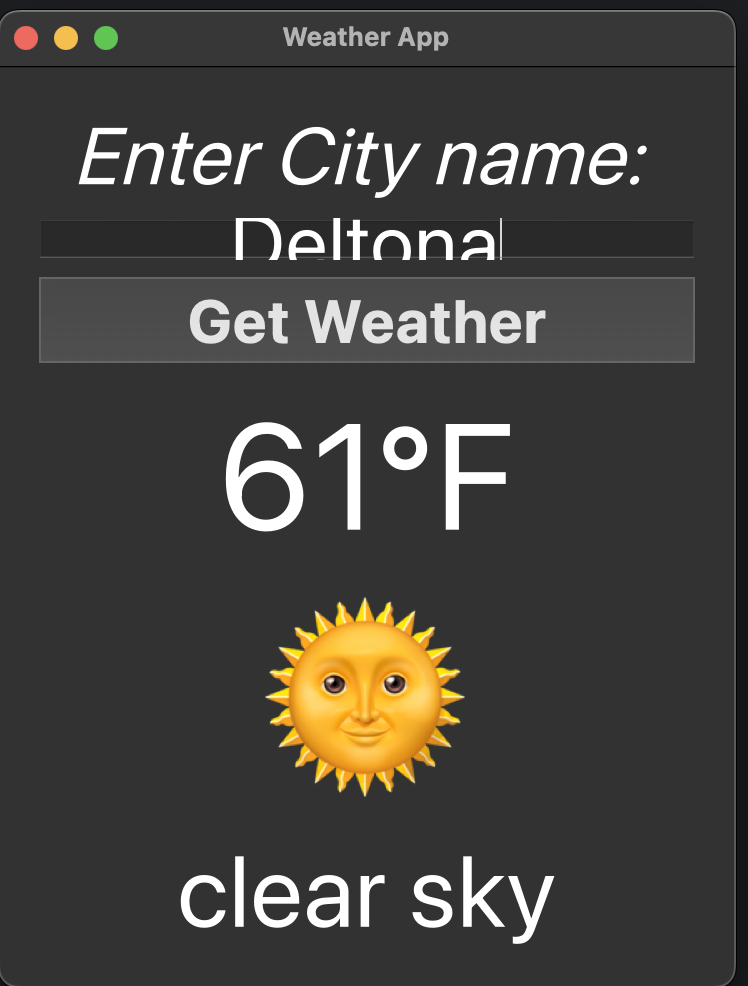
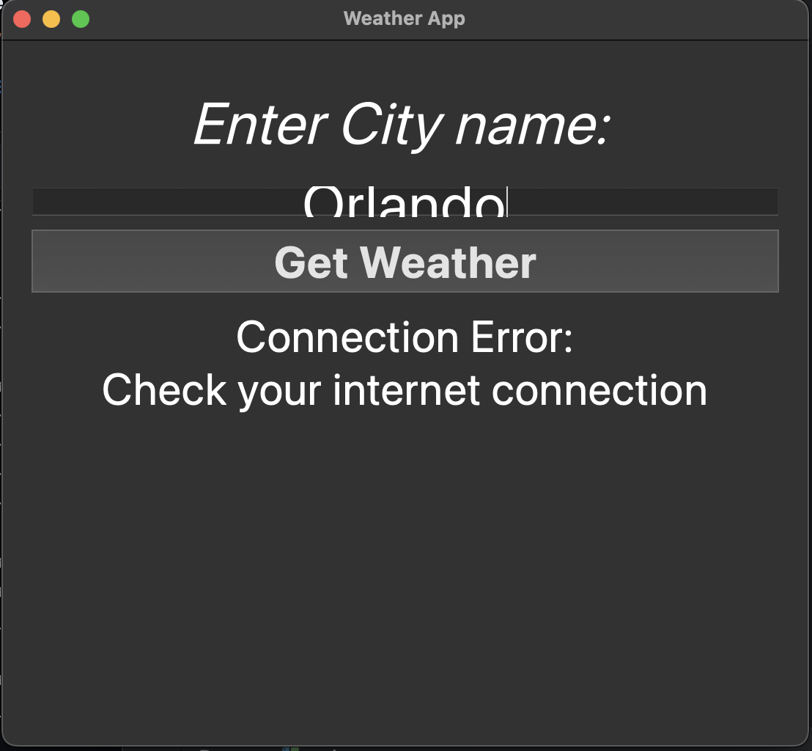

# WeatherApp 🌦️

A user-friendly desktop application that provides real-time weather updates for any city worldwide. Built with **Python** and **PyQt5**, it demonstrates my ability to integrate APIs, design graphical user interfaces, and handle errors effectively.

## 🚀 Features
- Search for current weather by city name.
- Click the "Get Weather" button.
- Displays:
  - Temperature in Fahrenheit.
  - Weather description with an emoji.
- Handles various errors gracefully (e.g., invalid city names, API errors).
- Clean and intuitive user interface.

## 🛠️ Technologies Used
- **Python**: Core programming language.
- **PyQt5**: For creating the graphical user interface.
- **OpenWeatherMap API**: To fetch real-time weather data.
- **Requests Library**: For making HTTP requests.

## 📸 Screenshots
### Main Interface


### Error Handling


## 📋 Prerequisites
Before running the application, ensure you have the following installed:
- Python 3.7 or higher
- Required Python libraries (see below)

## 🔧 Installation and Setup
1. Clone this repository to your local machine:
   ```bash
   git clone https://github.com/yourusername/WeatherApp.git
   cd WeatherApp
   ```
2. Obbatin an API key from OpenWeatherMap and replace the placeholder in weather_app.py:
```bash
   pip install -r requirements.txt
```
4. Run the application:
```bash
   python weather_app.py
```
